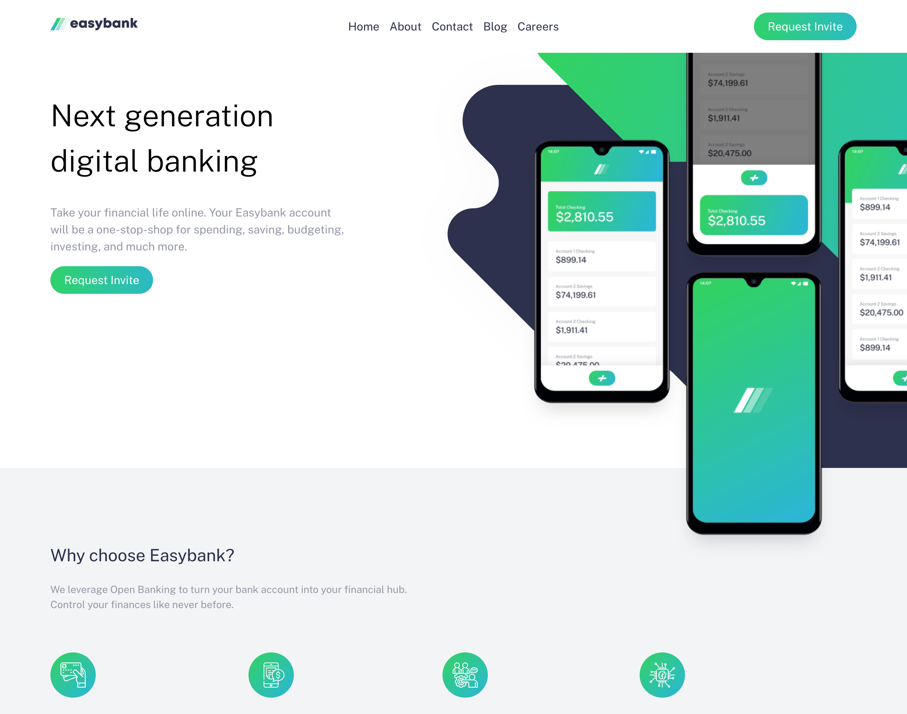

# eazybank-beck

# Frontend Mentor - Easybank Landing page solution

This is a solution to the [Easybank Landing page challenge on Frontend Mentor](https://www.frontendmentor.io/challenges/easybank-landing-page-WaUhkoDN/hub). Frontend Mentor challenges help you improve your coding skills by building realistic projects.

## Table of contents

- [Overview](#overview)
  - [The challenge](#the-challenge)
  - [Screenshot](#screenshot)
  - [Links](#links)
- [My process](#my-process)
  - [Built with](#built-with)
  - [Useful resources](#useful-resources)
- [Author](#author)

## Overview

### The challenge

Users should be able to:

- View the optimal layout for the app depending on their device's screen size
- See hover states for all interactive elements on the page

### Screenshot

### Links

- Solution URL: [Add solution URL here](https://your-solution-url.com)
- Live Site URL: [Add live site URL here](https://your-live-site-url.com)

## My process

### Built with

- Semantic HTML5 markup
- CSS custom properties
- Flexbox
- Mobile-first workflow
- [React](https://reactjs.org/) - JS library
- [Next.js](https://vitejs.dev/) - Build Tool

### Useful resources

- [CSSTricks](https://css-tricks.com/change-color-of-svg-on-hover/) - This helped me in learnign different ways/methods in changing the color of SVG icons. I really liked this pattern and will use it going forward.

## Author

- Website - [Beck Kanno](https://www.bekanno.com)
- Frontend Mentor - [@yourusername](https://www.frontendmentor.io/profile/altBeck)
- Twitter - [@designrgodd](https://twitter.com/designrgodd)

